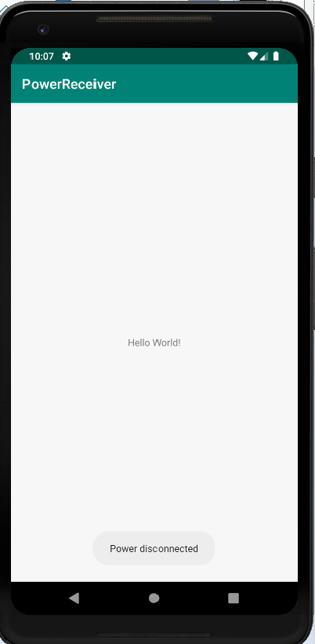
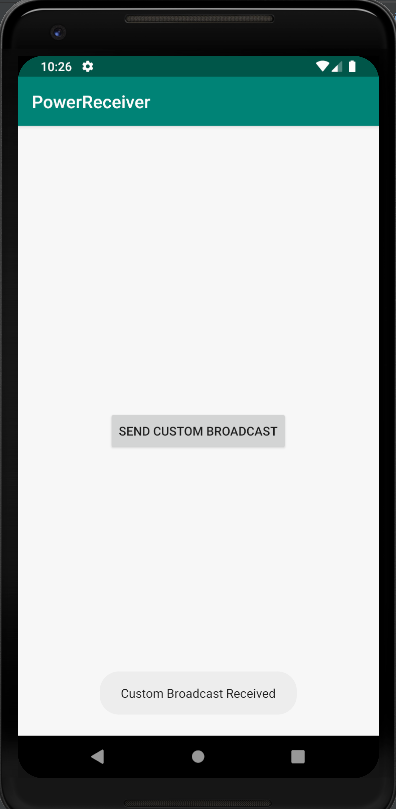
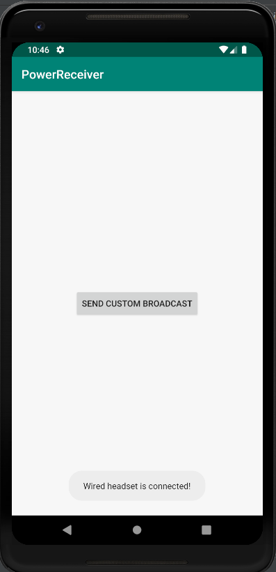
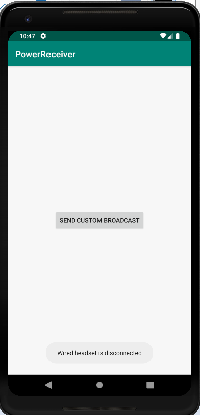
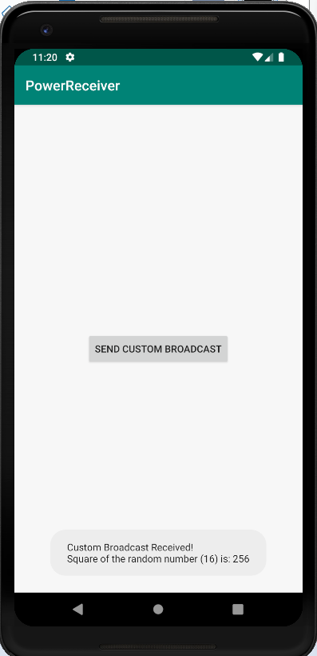

# BroadcastReceiverCodelab
Broadcast Receive Codelab

Overview file is attached as a word file: BroadcastReceiversOverview.docx

Instructions:

- Run the Android project under the "base" folder.
- Create a new Virtual Device if not already. Then, choose Pixel 2 XL, then click OK.
- It will load the app for broadcast receiver.

